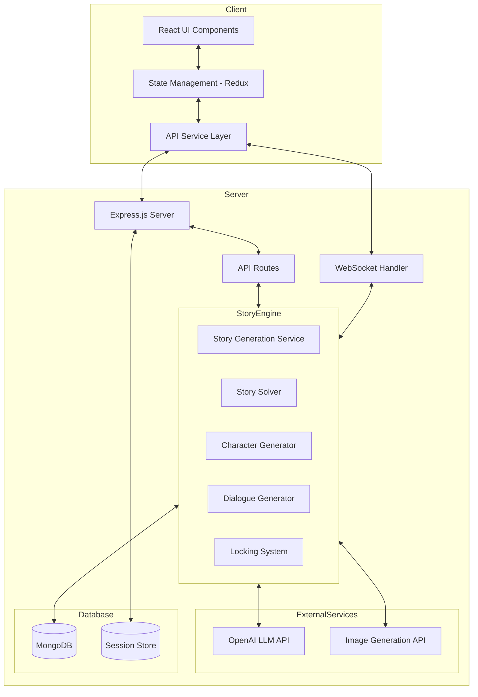

# Story Engine Engineering Specification

## Overview

This specification outlines the implementation details for the Story Engine system, a comprehensive narrative generation platform that creates and maintains dynamic, player-responsive stories. The system consists of two main components:

1. A React TypeScript web application (frontend)
2. A server application that handles the story engine logic (backend)

## Technology Stack

### Frontend
- **Framework**: React 18+ with TypeScript
- **Build Tool**: Vite for faster development experience
- **State Management**: Redux Toolkit for global state management
- **Styling**: Tailwind CSS with a custom theme for visual novel aesthetics
- **Routing**: React Router for navigation between story sections
- **API Communication**: Axios for HTTP requests to the backend

### Backend
- **Runtime**: Node.js with Express.js
- **Language**: TypeScript
- **Database**: MongoDB for story state persistence
- **LLM Integration**: OpenAI API client
- **Image Generation**: DALL-E 3 or Midjourney API for character portraits
- **Session Management**: Express-session with MongoDB session store
- **Authentication**: JSON Web Tokens for user session management
- **WebSockets**: Socket.IO for real-time updates when story elements change

## System Architecture

## Detailed Component Specifications

### 1. Frontend Components

#### Core UI Components
- **StoryView**: Main visual novel interface displaying character portraits and dialogue
- **DialogueOptions**: Component for rendering and selecting dialogue choices
- **CharacterPortrait**: Component for displaying character images with animations
- **LocationSelector**: Interface for selecting locations to visit
- **CharacterSelector**: Interface for selecting characters to interact with
- **SaveLoadInterface**: UI for saving/loading story progress

#### State Management
- **storySlice**: Redux slice for story state (current characters, plot points, player choices)
- **sessionSlice**: Redux slice for session management
- **uiSlice**: Redux slice for UI state (transitions, animations, settings)

#### API Services
- **StoryService**: Handles API calls to the story engine
- **AuthService**: Manages session authentication
- **WebSocketService**: Establishes and maintains WebSocket connection for real-time updates

### 2. Backend Components

#### Express Server Setup
- RESTful API endpoints for story management
- WebSocket server for real-time updates
- Authentication middleware
- Session management
- Error handling middleware
- Rate limiting for API requests

#### Story Engine Core

##### Story Generation Service
- Initializes story elements based on initial prompt
- Generates setting, protagonist framework, plot, and initial cast
- Uses OpenAI's GPT API with carefully crafted prompts for each component

##### Character System
- **CharacterGenerator**: Creates new characters as needed
- **CharacterUpdater**: Updates character attributes based on story changes
- **CharacterImageGenerator**: Interfaces with image generation API to create portraits

##### Story Solver
- **LockingService**: Tracks and enforces locked story elements
- **ConsistencyChecker**: Validates story changes for logical consistency
- **PlotSolver**: Resolves plot inconsistencies and manages narrative arcs
- **CastSolver**: Manages the cast of characters, adding/removing as needed
- **CharacterSolver**: Updates individual characters based on world state
- **TriggerSystem**: Monitors and executes conditional story events

##### Dialogue System
- **DialogueGenerator**: Creates character dialogue based on personality and knowledge
- **OptionGenerator**: Creates player dialogue options based on current context
- **DialogueValidator**: Ensures generated dialogue maintains story consistency

#### Database Schema
- **StoryModel**: Schema for storing complete story data
- **CharacterModel**: Schema for character information
- **PlayerModel**: Schema for player choices and attributes
- **WorldStateModel**: Schema for current world state and locked elements
- **SessionModel**: Schema for user sessions and save states

## Implementation Plan

### Phase 1: Foundational Setup
1. Initialize frontend and backend projects with TypeScript configurations
2. Set up MongoDB and basic database schemas
3. Create basic API endpoints and WebSocket infrastructure
4. Implement authentication and session management
5. Establish OpenAI API integration

### Phase 2: Core Story Engine
1. Implement story generation service
2. Create character system with basic generation capabilities
3. Develop basic locking system
4. Build initial dialogue generation system
5. Implement story solver with basic consistency checking

### Phase 3: Frontend Development
1. Create core UI components
2. Implement state management
3. Build visual novel interface
4. Create location and character selection interfaces
5. Implement API services for communication with backend

### Phase 4: Integration and Enhancement
1. Connect frontend and backend systems
2. Implement image generation for character portraits
3. Enhance story solver with more sophisticated resolution strategies
4. Develop more advanced dialogue generation
5. Implement save/load functionality

## Technical Specifications

### API Endpoints

#### Story Management
- `POST /api/stories` - Create a new story from prompt
- `GET /api/stories/:id` - Retrieve story state
- `POST /api/stories/:id/dialogue` - Get character dialogue and options
- `POST /api/stories/:id/select-option` - Select dialogue option
- `POST /api/stories/:id/change-location` - Change player location
- `POST /api/stories/:id/select-character` - Select character to interact with

#### Session Management
- `POST /api/auth/register` - Register new user
- `POST /api/auth/login` - Log in user
- `POST /api/auth/logout` - Log out user
- `GET /api/auth/session` - Check session status

#### Save/Load
- `POST /api/stories/:id/save` - Save story state
- `GET /api/stories/saved` - Get list of saved stories
- `GET /api/stories/saved/:id` - Load saved story

### WebSocket Events

- `story:update` - Story state has been updated
- `character:new` - New character has been added
- `character:update` - Character has been updated
- `dialogue:options` - New dialogue options available
- `plot:trigger` - Plot trigger has been activated

### LLM Prompting Strategy

The system will use a chain-of-thought approach with the OpenAI API, structuring prompts to:
1. Provide clear context about the current story state
2. Include specific instructions about what to generate
3. Format output in a structured JSON format for easy parsing
4. Include examples of desired outputs
5. Use system messages to enforce narrative consistency and quality

### Character Portrait Generation

Character portraits will be generated using:
1. Detailed textual descriptions derived from character data
2. Consistent art style prompts for visual coherence
3. Emotion variations for different dialogue states
4. Background elements that reflect character location

### Database Indices and Performance

- Index story documents by user ID and creation date
- Index character documents by story ID
- Use MongoDB aggregation pipeline for efficient story state retrieval
- Implement caching for frequently accessed story elements
- Store generated character images in a CDN with references in the database

## Future Extensions

1. **Multi-modal storytelling**: Adding audio narration and background music
2. **Advanced character animations**: More sophisticated visual responses
3. **Story templates**: Pre-defined story frameworks for quick generation
4. **User-contributed content**: Allow users to create and share story settings
5. **Alternative LLM providers**: Support for multiple AI providers

## Development Guidelines

1. Follow TypeScript best practices with strict type checking
2. Implement comprehensive unit and integration tests
3. Document all components and functions with JSDoc
4. Use semantic versioning for releases
5. Maintain a detailed changelog